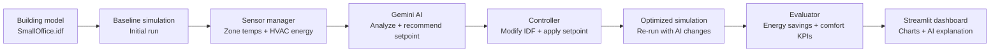

# Architecture: AI-driven HVAC optimization pipeline

This document describes the end-to-end pipeline that uses an LLM (Gemini) (Local models werent used due to lack of resources) to
recommend HVAC setpoint adjustments for an EnergyPlus building model, applies
them, and evaluates the resulting energy and comfort impact.

## Overview

## Pipeline stages

### 1. Building model
- **Input:** `SmallOffice.idf`, a standard EnergyPlus building model.
- Serves as the ground-truth building definition for both the baseline and
  optimized simulation runs.

### 2. Baseline simulation
- Runs the unmodified building model through EnergyPlus.
- Establishes the reference energy and comfort performance that all later
  improvements are measured against.

### 3. Sensor manager
- Extracts key signals from the baseline simulation output:
  - Zone temperatures
  - HVAC energy consumption
- Packages this data into a structured "building state" for the AI stage.

### 4. Gemini AI
- Takes the building state as input.
- Analyzes current conditions and recommends an HVAC setpoint adjustment.
- Returns a confidence score alongside the recommendation, so downstream
  stages (or a human reviewer) can gauge how much to trust the suggestion.

### 5. Controller
- Takes the AI's recommendation and confidence score.
- Modifies the EnergyPlus IDF file to apply the new HVAC setpoint.
- Acts as the boundary between the AI's output and the simulation input —
  no AI output reaches the model without passing through this stage.

### 6. Optimized simulation
- Re-runs EnergyPlus on the modified IDF file.
- Produces the "after" performance data used for comparison against the
  baseline.

### 7. Evaluator
- Compares baseline vs. optimized simulation results.
- Computes:
  - Energy savings
  - Comfort validation (e.g. whether zone temperatures stay within
    acceptable bounds)
  - Aggregate KPIs for reporting

### 8. Streamlit dashboard
- Visualizes the full pipeline output:
  - Charts comparing baseline vs. optimized performance
  - The AI's explanation/reasoning for its recommendation
  - Summary metrics and KPIs from the evaluator

## Data flow summary

| Stage | Input | Output |
|---|---|---|
| Building model | — | `SmallOffice.idf` |
| Baseline simulation | IDF file | Baseline energy + comfort data |
| Sensor manager | Baseline sim output | Structured building state |
| Gemini AI | Building state | Setpoint recommendation + confidence |
| Controller | AI recommendation | Modified IDF file |
| Optimized simulation | Modified IDF file | Optimized energy + comfort data |
| Evaluator | Baseline + optimized results | Savings %, comfort validation, KPIs |
| Dashboard | Evaluator output | Interactive visualization |

## Notes

- The controller is the only stage that writes back into the simulation
  input, keeping the AI's influence auditable and reversible.
- Confidence scores from Gemini can be used to gate auto-application of
  recommendations vs. flagging them for manual review.
